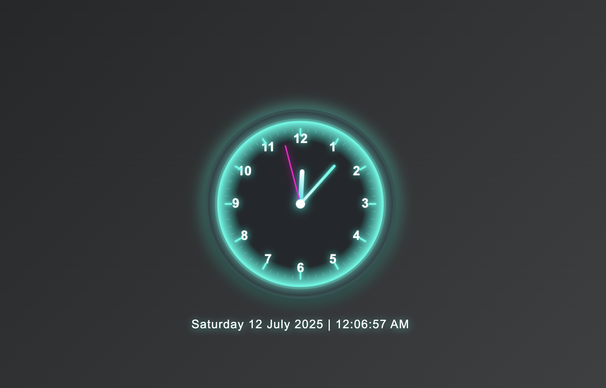

# Analog Clock New Tab Chrome Extension

A beautiful Chrome extension that replaces your new tab page with a fancy analog clock and real-time date/time display.

## Features

- Modern analog clock with glowing neon and glassmorphism effects
- Real-time 12-hour time display with AM/PM
- Current date shown in a stylish format
- Responsive and visually appealing design

## Installation

1. Clone or download this repository to your computer.
2. Open Chrome and go to `chrome://extensions/`.
3. Enable "Developer mode" (top right).
4. Click "Load unpacked" and select this project folder.
5. Open a new tab to see your custom clock!

## Files

- `manifest.json`: Chrome extension manifest (v3)
- `new_tab.html`: The new tab page layout
- `style.css`: Fancy styles for the clock and date
- `script.js`: Clock drawing and real-time logic

## Customization

You can edit `style.css` and `script.js` to further personalize the look and feel of your clock.

## Screenshots

 <!-- Add a screenshot if you wish -->

---

Created with ❤️ by nit90esh
